# Sequence Diagram — Các luồng nghiệp vụ chính

**Dự án:** Multi-vendor Marketplace MVP
**Nguồn:** `contracts/api.md`, `plan.md` (mục 04 và 07), `docs/database/data-design.md`, `spec.md` (BR-01–BR-10)
**Phạm vi:** 16 sơ đồ tuần tự cho các luồng quan trọng và các nhánh lỗi/đồng thời.

**Quy ước tên thành phần**

| Tên | Ý nghĩa |
| --- | --- |
| Client | Web (Next.js), Mobile (Expo) hoặc Desktop (Tauri) |
| API | NestJS: controller, guard xác thực/phân quyền, validation, middleware CSRF/request-id |
| Identity, Shop, Catalog, Inventory, Cart, Order, Payment, Shipping, Review, Admin | Module trong `apps/api/src/modules/*` |
| DB | PostgreSQL (mọi ghi quan trọng trong transaction) |
| Storage | Object storage S3-compatible |
| Scheduler | Job nền trong `modules/payment/jobs` |

**Metadata request dùng chung:** Các POST thuộc nhóm lệnh chống lặp sau trong các sơ đồ đều gửi HTTP header `Idempotency-Key: <UUID>`: checkout (S05–S06), payment attempt/result (S07–S08, gồm `POST /payments/:id/mock-result`), điều chỉnh tồn, hủy/xác nhận/đóng gói/từ chối/nhận hàng, shipment events/retry/return, thu COD (S10–S13), khóa tài khoản và Admin recovery (S15). Quy ước này áp dụng cả khi nhãn lời gọi chỉ ghi body; `Idempotency-Key` là header. Mỗi lệnh mới dùng key mới; gửi lại cùng lệnh giữ nguyên key và body.

**Trạng thái code** (đối chiếu 77 route thực tế tại `main`, commit `8ee488a`; không phải kết quả test): S01–S13 và S15 có route tương ứng. S14 (đánh giá) và S16 (dashboard, doanh thu Seller) thuộc US8, **chưa có mã** và là thiết kế theo contract.

| # | Luồng | UC | Trạng thái |
| --- | --- | --- | --- |
| S01 | Đăng ký, đăng nhập, refresh, đăng xuất | UC-01.1–01.3 | Có code |
| S02 | Đăng ký shop và Admin duyệt | UC-02.1, 02.2 | Có code |
| S03 | Upload ảnh và tạo sản phẩm | UC-03.2, 03.6 | Có code |
| S04 | Tìm kiếm và xem chi tiết sản phẩm | UC-04.1, 04.2 | Có code |
| S05 | Giỏ hàng, báo giá, checkout đa shop | UC-05.1–05.3 | Có code |
| S06 | Hai Buyer tranh đơn vị tồn cuối | UC-05.3 | Có code |
| S07 | Thanh toán mô phỏng và thử lại | UC-07.1 | Có code |
| S08 | Kết quả thanh toán đến muộn | UC-07.4 | Có code |
| S09 | Hết hạn thanh toán | UC-07.3 | Có code |
| S10 | Hủy đơn (Buyer) và từ chối đơn (Seller) | UC-06.4 | Có code |
| S11 | Seller xác nhận và đóng gói | UC-06.3 | Có code |
| S12 | Giao hàng, thu COD, nhận hàng, hoàn tất | UC-08.1, 07.2, 06.5 | Có code |
| S13 | Giao thất bại, giao lại, hoàn về | UC-08.2 | Có code |
| S14 | Đánh giá sản phẩm | UC-09.1 | Thiết kế (US8) |
| S15 | Admin khóa tài khoản, xử lý đơn thay Seller | UC-10.1, 10.4 | Có code |
| S16 | Dashboard và doanh thu Seller | UC-09.3 | Thiết kế (US8) |

---

## S01. Đăng ký, đăng nhập, refresh, đăng xuất (Web)

Web giữ access token trong bộ nhớ; refresh token nằm trong cookie HttpOnly. Mọi mutation dùng CSRF token và kiểm tra Origin.

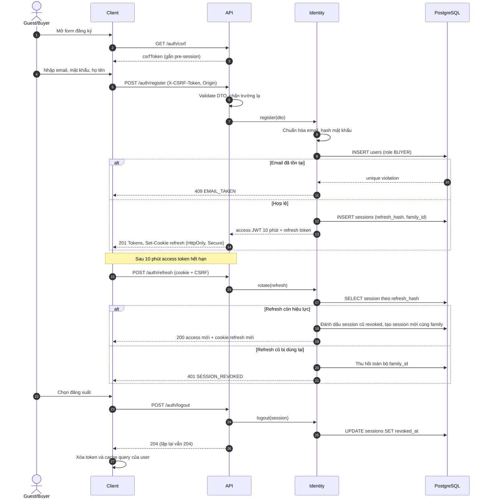
```mermaid
sequenceDiagram
  autonumber
  actor U as Guest/Buyer
  participant C as Client
  participant API as API
  participant ID as Identity
  participant DB as PostgreSQL

  U->>C: Mở form đăng ký
  C->>API: GET /auth/csrf
  API-->>C: csrfToken (gắn pre-session)

  U->>C: Nhập email, mật khẩu, họ tên
  C->>API: POST /auth/register (X-CSRF-Token, Origin)
  API->>API: Validate DTO, chặn trường lạ
  API->>ID: register(dto)
  ID->>ID: Chuẩn hóa email, hash mật khẩu
  ID->>DB: INSERT users (role BUYER)
  alt Email đã tồn tại
    DB-->>ID: unique violation
    ID-->>C: 409 EMAIL_TAKEN
  else Hợp lệ
    ID->>DB: INSERT sessions (refresh_hash, family_id)
    ID-->>API: access JWT 10 phút + refresh token
    API-->>C: 201 Tokens, Set-Cookie refresh (HttpOnly, Secure)
  end

  Note over C,API: Sau 10 phút access token hết hạn
  C->>API: POST /auth/refresh (cookie + CSRF)
  API->>ID: rotate(refresh)
  ID->>DB: SELECT session theo refresh_hash
  alt Refresh còn hiệu lực
    ID->>DB: Đánh dấu session cũ revoked, tạo session mới cùng family
    ID-->>C: 200 access mới + cookie refresh mới
  else Refresh cũ bị dùng lại
    ID->>DB: Thu hồi toàn bộ family_id
    ID-->>C: 401 SESSION_REVOKED
  end

  U->>C: Chọn đăng xuất
  C->>API: POST /auth/logout
  API->>ID: logout(session)
  ID->>DB: UPDATE sessions SET revoked_at
  API-->>C: 204 (lặp lại vẫn 204)
  C->>C: Xóa token và cache query của user
```

Đăng nhập (`POST /auth/login`) cùng cấu trúc bước 2–5 của đăng ký: sai thông tin trả `401 INVALID_CREDENTIALS` (thông báo chung), tài khoản LOCKED trả `403`, vượt tần suất trả `429`.

---

## S02. Đăng ký shop và Admin duyệt

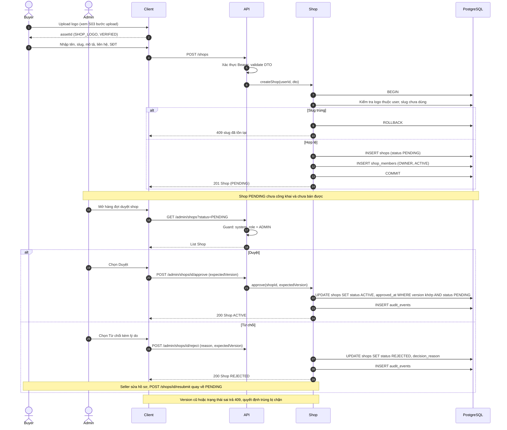
```mermaid
sequenceDiagram
  autonumber
  actor B as Buyer
  actor A as Admin
  participant C as Client
  participant API as API
  participant SH as Shop
  participant DB as PostgreSQL

  B->>C: Upload logo (xem S03 bước upload)
  C-->>B: assetId (SHOP_LOGO, VERIFIED)
  B->>C: Nhập tên, slug, mô tả, liên hệ, SĐT
  C->>API: POST /shops
  API->>API: Xác thực Bearer, validate DTO
  API->>SH: createShop(userId, dto)
  SH->>DB: BEGIN
  SH->>DB: Kiểm tra logo thuộc user, slug chưa dùng
  alt Slug trùng
    SH->>DB: ROLLBACK
    SH-->>C: 409 slug đã tồn tại
  else Hợp lệ
    SH->>DB: INSERT shops (status PENDING)
    SH->>DB: INSERT shop_members (OWNER, ACTIVE)
    SH->>DB: COMMIT
    SH-->>C: 201 Shop (PENDING)
  end

  Note over A,DB: Shop PENDING chưa công khai và chưa bán được

  A->>C: Mở hàng đợi duyệt shop
  C->>API: GET /admin/shops?status=PENDING
  API->>API: Guard: system_role = ADMIN
  API-->>C: List Shop

  alt Duyệt
    A->>C: Chọn Duyệt
    C->>API: POST /admin/shops/id/approve (expectedVersion)
    API->>SH: approve(shopId, expectedVersion)
    SH->>DB: UPDATE shops SET status ACTIVE, approved_at WHERE version khớp AND status PENDING
    SH->>DB: INSERT audit_events
    SH-->>C: 200 Shop ACTIVE
  else Từ chối
    A->>C: Chọn Từ chối kèm lý do
    C->>API: POST /admin/shops/id/reject (reason, expectedVersion)
    SH->>DB: UPDATE shops SET status REJECTED, decision_reason
    SH->>DB: INSERT audit_events
    SH-->>C: 200 Shop REJECTED
    Note over B,SH: Seller sửa hồ sơ, POST /shops/id/resubmit quay về PENDING
  end

  Note over SH,C: Version cũ hoặc trạng thái sai trả 409, quyết định trùng bị chặn
```

---

## S03. Upload ảnh và tạo sản phẩm kèm biến thể

Việc gọi Object Storage nằm **ngoài** transaction DB (Asset đi từ PENDING sang VERIFIED).

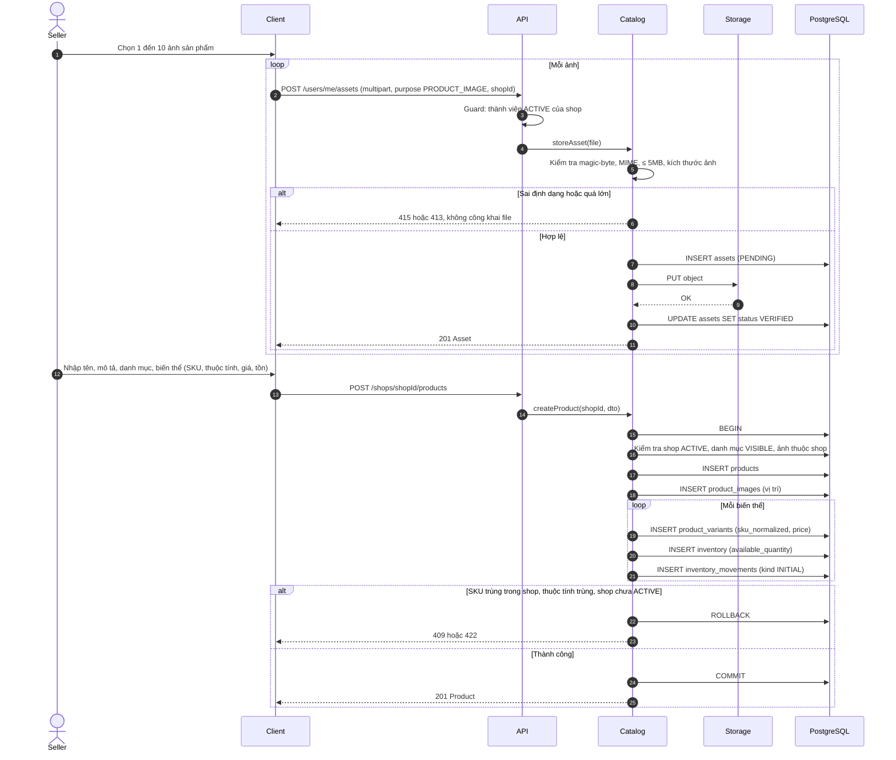
```mermaid
sequenceDiagram
  autonumber
  actor S as Seller
  participant C as Client
  participant API as API
  participant CAT as Catalog
  participant ST as Storage
  participant DB as PostgreSQL

  S->>C: Chọn 1 đến 10 ảnh sản phẩm
  loop Mỗi ảnh
    C->>API: POST /users/me/assets (multipart, purpose PRODUCT_IMAGE, shopId)
    API->>API: Guard: thành viên ACTIVE của shop
    API->>CAT: storeAsset(file)
    CAT->>CAT: Kiểm tra magic-byte, MIME, ≤ 5MB, kích thước ảnh
    alt Sai định dạng hoặc quá lớn
      CAT-->>C: 415 hoặc 413, không công khai file
    else Hợp lệ
      CAT->>DB: INSERT assets (PENDING)
      CAT->>ST: PUT object
      ST-->>CAT: OK
      CAT->>DB: UPDATE assets SET status VERIFIED
      CAT-->>C: 201 Asset
    end
  end

  S->>C: Nhập tên, mô tả, danh mục, biến thể (SKU, thuộc tính, giá, tồn)
  C->>API: POST /shops/shopId/products
  API->>CAT: createProduct(shopId, dto)
  CAT->>DB: BEGIN
  CAT->>DB: Kiểm tra shop ACTIVE, danh mục VISIBLE, ảnh thuộc shop
  CAT->>DB: INSERT products
  CAT->>DB: INSERT product_images (vị trí)
  loop Mỗi biến thể
    CAT->>DB: INSERT product_variants (sku_normalized, price)
    CAT->>DB: INSERT inventory (available_quantity)
    CAT->>DB: INSERT inventory_movements (kind INITIAL)
  end
  alt SKU trùng trong shop, thuộc tính trùng, shop chưa ACTIVE
    CAT->>DB: ROLLBACK
    CAT-->>C: 409 hoặc 422
  else Thành công
    CAT->>DB: COMMIT
    CAT-->>C: 201 Product
  end
```

---

## S04. Tìm kiếm và xem chi tiết sản phẩm

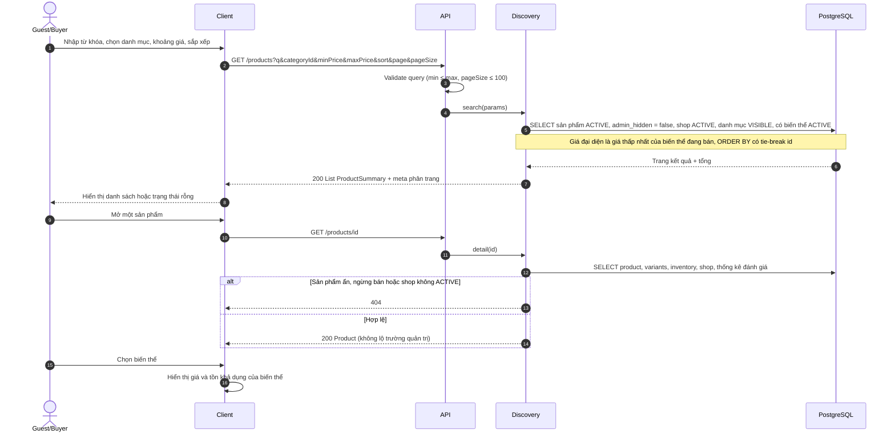
```mermaid
sequenceDiagram
  autonumber
  actor G as Guest/Buyer
  participant C as Client
  participant API as API
  participant DIS as Discovery
  participant DB as PostgreSQL

  G->>C: Nhập từ khóa, chọn danh mục, khoảng giá, sắp xếp
  C->>API: GET /products?q&categoryId&minPrice&maxPrice&sort&page&pageSize
  API->>API: Validate query (min ≤ max, pageSize ≤ 100)
  API->>DIS: search(params)
  DIS->>DB: SELECT sản phẩm ACTIVE, admin_hidden = false, shop ACTIVE, danh mục VISIBLE, có biến thể ACTIVE
  Note over DIS,DB: Giá đại diện là giá thấp nhất của biến thể đang bán, ORDER BY có tie-break id
  DB-->>DIS: Trang kết quả + tổng
  DIS-->>C: 200 List ProductSummary + meta phân trang
  C-->>G: Hiển thị danh sách hoặc trạng thái rỗng

  G->>C: Mở một sản phẩm
  C->>API: GET /products/id
  API->>DIS: detail(id)
  DIS->>DB: SELECT product, variants, inventory, shop, thống kê đánh giá
  alt Sản phẩm ẩn, ngừng bán hoặc shop không ACTIVE
    DIS-->>C: 404
  else Hợp lệ
    DIS-->>C: 200 Product (không lộ trường quản trị)
  end
  G->>C: Chọn biến thể
  C->>C: Hiển thị giá và tồn khả dụng của biến thể
```

---

## S05. Giỏ hàng, báo giá và checkout đa shop

Đây là luồng cốt lõi: **một Order tổng, mỗi shop một SellerOrder**, trừ tồn nguyên tử, idempotent.

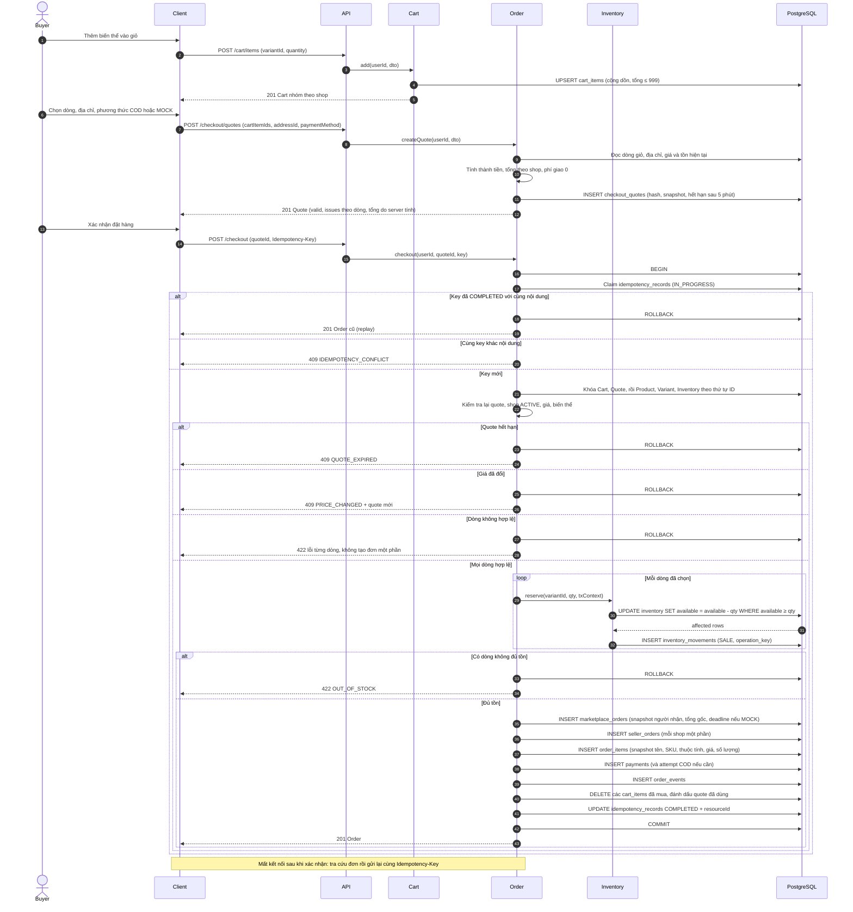
```mermaid
sequenceDiagram
  autonumber
  actor B as Buyer
  participant C as Client
  participant API as API
  participant CART as Cart
  participant ORD as Order
  participant INV as Inventory
  participant DB as PostgreSQL

  B->>C: Thêm biến thể vào giỏ
  C->>API: POST /cart/items (variantId, quantity)
  API->>CART: add(userId, dto)
  CART->>DB: UPSERT cart_items (cộng dồn, tổng ≤ 999)
  CART-->>C: 201 Cart nhóm theo shop

  B->>C: Chọn dòng, địa chỉ, phương thức COD hoặc MOCK
  C->>API: POST /checkout/quotes (cartItemIds, addressId, paymentMethod)
  API->>ORD: createQuote(userId, dto)
  ORD->>DB: Đọc dòng giỏ, địa chỉ, giá và tồn hiện tại
  ORD->>ORD: Tính thành tiền, tổng theo shop, phí giao 0
  ORD->>DB: INSERT checkout_quotes (hash, snapshot, hết hạn sau 5 phút)
  ORD-->>C: 201 Quote (valid, issues theo dòng, tổng do server tính)

  B->>C: Xác nhận đặt hàng
  C->>API: POST /checkout (quoteId, Idempotency-Key)
  API->>ORD: checkout(userId, quoteId, key)
  ORD->>DB: BEGIN
  ORD->>DB: Claim idempotency_records (IN_PROGRESS)
  alt Key đã COMPLETED với cùng nội dung
    ORD->>DB: ROLLBACK
    ORD-->>C: 201 Order cũ (replay)
  else Cùng key khác nội dung
    ORD-->>C: 409 IDEMPOTENCY_CONFLICT
  else Key mới
    ORD->>DB: Khóa Cart, Quote, rồi Product, Variant, Inventory theo thứ tự ID
    ORD->>ORD: Kiểm tra lại quote, shop ACTIVE, giá, biến thể
    alt Quote hết hạn
      ORD->>DB: ROLLBACK
      ORD-->>C: 409 QUOTE_EXPIRED
    else Giá đã đổi
      ORD->>DB: ROLLBACK
      ORD-->>C: 409 PRICE_CHANGED + quote mới
    else Dòng không hợp lệ
      ORD->>DB: ROLLBACK
      ORD-->>C: 422 lỗi từng dòng, không tạo đơn một phần
    else Mọi dòng hợp lệ
      loop Mỗi dòng đã chọn
        ORD->>INV: reserve(variantId, qty, txContext)
        INV->>DB: UPDATE inventory SET available = available - qty WHERE available ≥ qty
        DB-->>INV: affected rows
        INV->>DB: INSERT inventory_movements (SALE, operation_key)
      end
      alt Có dòng không đủ tồn
        ORD->>DB: ROLLBACK
        ORD-->>C: 422 OUT_OF_STOCK
      else Đủ tồn
        ORD->>DB: INSERT marketplace_orders (snapshot người nhận, tổng gốc, deadline nếu MOCK)
        ORD->>DB: INSERT seller_orders (mỗi shop một phần)
        ORD->>DB: INSERT order_items (snapshot tên, SKU, thuộc tính, giá, số lượng)
        ORD->>DB: INSERT payments (và attempt COD nếu cần)
        ORD->>DB: INSERT order_events
        ORD->>DB: DELETE các cart_items đã mua, đánh dấu quote đã dùng
        ORD->>DB: UPDATE idempotency_records COMPLETED + resourceId
        ORD->>DB: COMMIT
        ORD-->>C: 201 Order
      end
    end
  end
  Note over C,ORD: Mất kết nối sau khi xác nhận: tra cứu đơn rồi gửi lại cùng Idempotency-Key
```

---

## S06. Hai Buyer tranh đơn vị tồn cuối (SC-003)

Điểm mấu chốt: cập nhật có điều kiện làm DB tự phân xử, không cần khóa ứng dụng.

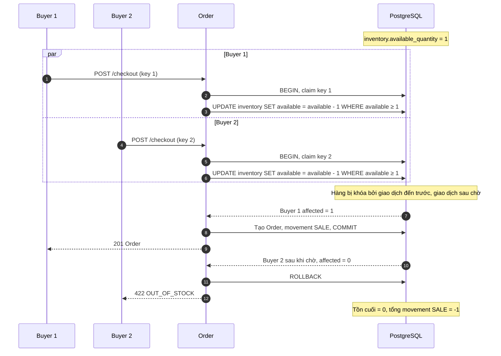
```mermaid
sequenceDiagram
  autonumber
  participant B1 as Buyer 1
  participant B2 as Buyer 2
  participant ORD as Order
  participant DB as PostgreSQL

  Note over DB: inventory.available_quantity = 1
  par Buyer 1
    B1->>ORD: POST /checkout (key 1)
    ORD->>DB: BEGIN, claim key 1
    ORD->>DB: UPDATE inventory SET available = available - 1 WHERE available ≥ 1
  and Buyer 2
    B2->>ORD: POST /checkout (key 2)
    ORD->>DB: BEGIN, claim key 2
    ORD->>DB: UPDATE inventory SET available = available - 1 WHERE available ≥ 1
  end
  Note over DB: Hàng bị khóa bởi giao dịch đến trước, giao dịch sau chờ
  DB-->>ORD: Buyer 1 affected = 1
  ORD->>DB: Tạo Order, movement SALE, COMMIT
  ORD-->>B1: 201 Order
  DB-->>ORD: Buyer 2 sau khi chờ, affected = 0
  ORD->>DB: ROLLBACK
  ORD-->>B2: 422 OUT_OF_STOCK
  Note over DB: Tồn cuối = 0, tổng movement SALE = -1
```

Kiểm thử mục tiêu: 20 yêu cầu song song với tồn 5 → đúng 5 thành công, 15 báo hết hàng, tồn cuối 0 (SC-003); gửi lại cùng checkout 10 lần chỉ tạo một hiệu lực (SC-004).

---

## S07. Thanh toán mô phỏng và thử lại

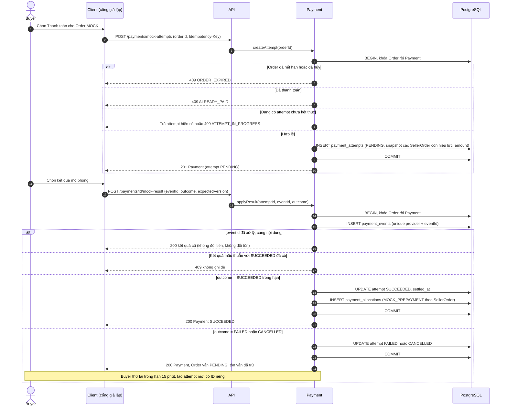
```mermaid
sequenceDiagram
  autonumber
  actor B as Buyer
  participant C as Client (cổng giả lập)
  participant API as API
  participant PAY as Payment
  participant DB as PostgreSQL

  B->>C: Chọn Thanh toán cho Order MOCK
  C->>API: POST /payments/mock-attempts (orderId, Idempotency-Key)
  API->>PAY: createAttempt(orderId)
  PAY->>DB: BEGIN, khóa Order rồi Payment
  alt Order đã hết hạn hoặc đã hủy
    PAY-->>C: 409 ORDER_EXPIRED
  else Đã thanh toán
    PAY-->>C: 409 ALREADY_PAID
  else Đang có attempt chưa kết thúc
    PAY-->>C: Trả attempt hiện có hoặc 409 ATTEMPT_IN_PROGRESS
  else Hợp lệ
    PAY->>DB: INSERT payment_attempts (PENDING, snapshot các SellerOrder còn hiệu lực, amount)
    PAY->>DB: COMMIT
    PAY-->>C: 201 Payment (attempt PENDING)
  end

  B->>C: Chọn kết quả mô phỏng
  C->>API: POST /payments/id/mock-result (eventId, outcome, expectedVersion)
  API->>PAY: applyResult(attemptId, eventId, outcome)
  PAY->>DB: BEGIN, khóa Order rồi Payment
  PAY->>DB: INSERT payment_events (unique provider + eventId)
  alt eventId đã xử lý, cùng nội dung
    PAY-->>C: 200 kết quả cũ (không đổi tiền, không đổi tồn)
  else Kết quả mâu thuẫn với SUCCEEDED đã có
    PAY-->>C: 409 không ghi đè
  else outcome = SUCCEEDED trong hạn
    PAY->>DB: UPDATE attempt SUCCEEDED, settled_at
    PAY->>DB: INSERT payment_allocations (MOCK_PREPAYMENT theo SellerOrder)
    PAY->>DB: COMMIT
    PAY-->>C: 200 Payment SUCCEEDED
  else outcome = FAILED hoặc CANCELLED
    PAY->>DB: UPDATE attempt FAILED hoặc CANCELLED
    PAY->>DB: COMMIT
    PAY-->>C: 200 Payment, Order vẫn PENDING, tồn vẫn đã trừ
    Note over B,PAY: Buyer thử lại trong hạn 15 phút, tạo attempt mới có ID riêng
  end
```

COD không đi qua luồng này: `Payment` COD được tạo ở S05 và tiền chỉ được ghi nhận ở S12.

---

## S08. Kết quả thanh toán đến muộn (bù trừ)

Khi `SUCCEEDED` đến **sau** khi đơn đã hết hạn hoặc bị hủy, hệ thống không mở lại đơn mà hoàn tiền mô phỏng đúng số đã nhận.

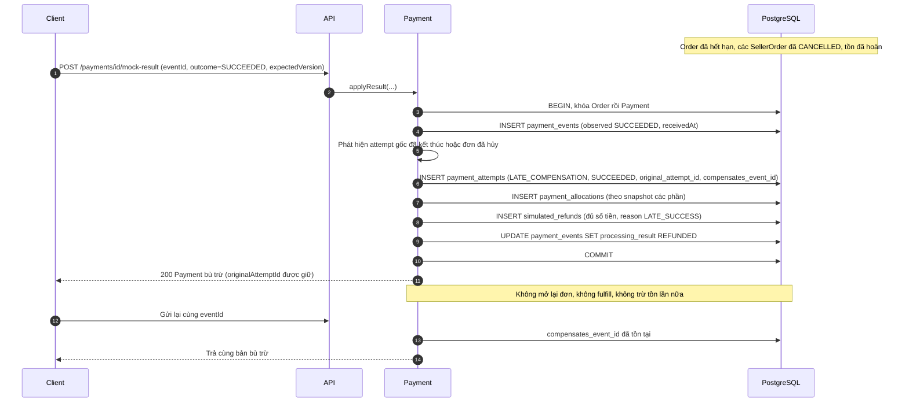
```mermaid
sequenceDiagram
  autonumber
  participant C as Client
  participant API as API
  participant PAY as Payment
  participant DB as PostgreSQL

  Note over DB: Order đã hết hạn, các SellerOrder đã CANCELLED, tồn đã hoàn
  C->>API: POST /payments/id/mock-result (eventId, outcome=SUCCEEDED, expectedVersion)
  API->>PAY: applyResult(...)
  PAY->>DB: BEGIN, khóa Order rồi Payment
  PAY->>DB: INSERT payment_events (observed SUCCEEDED, receivedAt)
  PAY->>PAY: Phát hiện attempt gốc đã kết thúc hoặc đơn đã hủy
  PAY->>DB: INSERT payment_attempts (LATE_COMPENSATION, SUCCEEDED, original_attempt_id, compensates_event_id)
  PAY->>DB: INSERT payment_allocations (theo snapshot các phần)
  PAY->>DB: INSERT simulated_refunds (đủ số tiền, reason LATE_SUCCESS)
  PAY->>DB: UPDATE payment_events SET processing_result REFUNDED
  PAY->>DB: COMMIT
  PAY-->>C: 200 Payment bù trừ (originalAttemptId được giữ)

  Note over PAY,DB: Không mở lại đơn, không fulfill, không trừ tồn lần nữa
  C->>API: Gửi lại cùng eventId
  PAY->>DB: compensates_event_id đã tồn tại
  PAY-->>C: Trả cùng bản bù trừ
```

---

## S09. Hết hạn thanh toán (Scheduler)

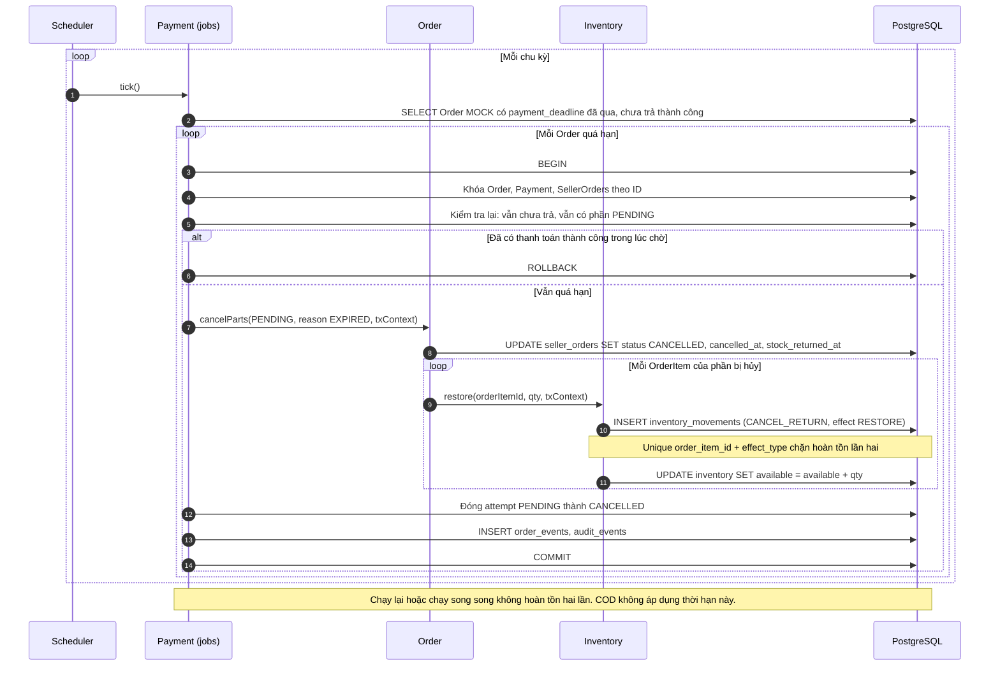
```mermaid
sequenceDiagram
  autonumber
  participant SCH as Scheduler
  participant PAY as Payment (jobs)
  participant ORD as Order
  participant INV as Inventory
  participant DB as PostgreSQL

  loop Mỗi chu kỳ
    SCH->>PAY: tick()
    PAY->>DB: SELECT Order MOCK có payment_deadline đã qua, chưa trả thành công
    loop Mỗi Order quá hạn
      PAY->>DB: BEGIN
      PAY->>DB: Khóa Order, Payment, SellerOrders theo ID
      PAY->>DB: Kiểm tra lại: vẫn chưa trả, vẫn có phần PENDING
      alt Đã có thanh toán thành công trong lúc chờ
        PAY->>DB: ROLLBACK
      else Vẫn quá hạn
        PAY->>ORD: cancelParts(PENDING, reason EXPIRED, txContext)
        ORD->>DB: UPDATE seller_orders SET status CANCELLED, cancelled_at, stock_returned_at
        loop Mỗi OrderItem của phần bị hủy
          ORD->>INV: restore(orderItemId, qty, txContext)
          INV->>DB: INSERT inventory_movements (CANCEL_RETURN, effect RESTORE)
          Note over INV,DB: Unique order_item_id + effect_type chặn hoàn tồn lần hai
          INV->>DB: UPDATE inventory SET available = available + qty
        end
        PAY->>DB: Đóng attempt PENDING thành CANCELLED
        PAY->>DB: INSERT order_events, audit_events
        PAY->>DB: COMMIT
      end
    end
  end
  Note over PAY,DB: Chạy lại hoặc chạy song song không hoàn tồn hai lần. COD không áp dụng thời hạn này.
```

---

## S10. Hủy đơn (Buyer) và từ chối đơn (Seller)

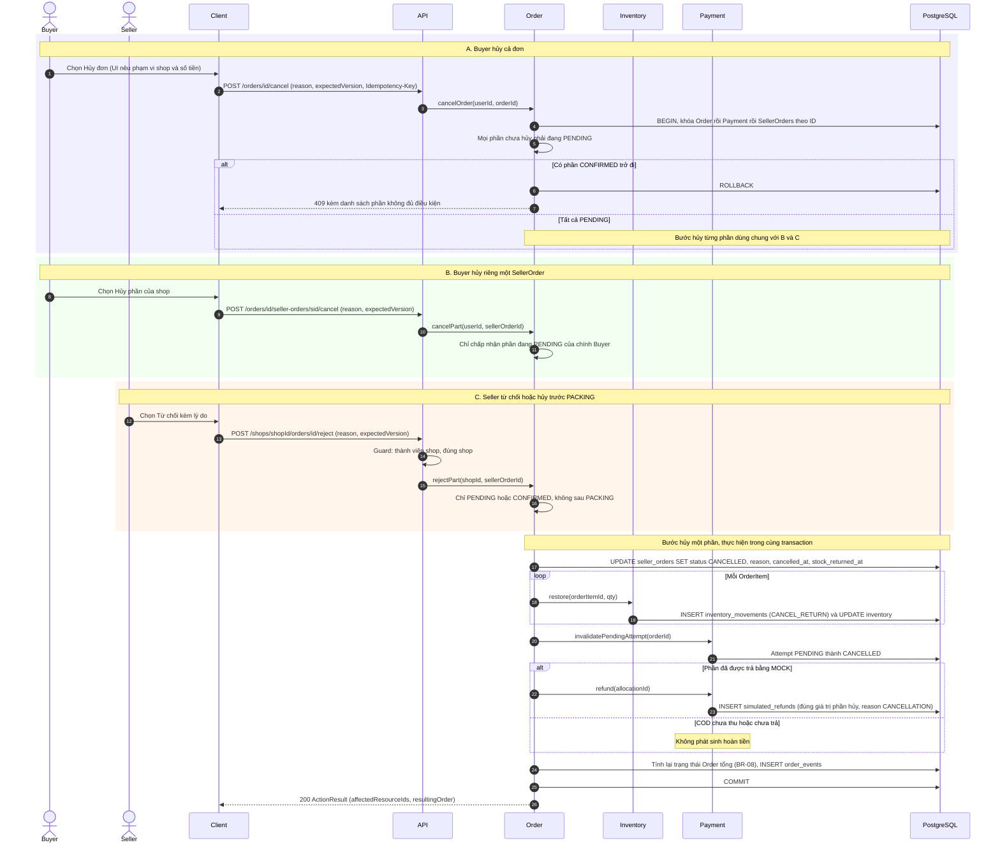
```mermaid
sequenceDiagram
  autonumber
  actor B as Buyer
  actor S as Seller
  participant C as Client
  participant API as API
  participant ORD as Order
  participant INV as Inventory
  participant PAY as Payment
  participant DB as PostgreSQL

  rect rgb(240, 240, 255)
    Note over B,DB: A. Buyer hủy cả đơn
    B->>C: Chọn Hủy đơn (UI nêu phạm vi shop và số tiền)
    C->>API: POST /orders/id/cancel (reason, expectedVersion, Idempotency-Key)
    API->>ORD: cancelOrder(userId, orderId)
    ORD->>DB: BEGIN, khóa Order rồi Payment rồi SellerOrders theo ID
    ORD->>ORD: Mọi phần chưa hủy phải đang PENDING
    alt Có phần CONFIRMED trở đi
      ORD->>DB: ROLLBACK
      ORD-->>C: 409 kèm danh sách phần không đủ điều kiện
    else Tất cả PENDING
      Note over ORD,DB: Bước hủy từng phần dùng chung với B và C
    end
  end

  rect rgb(240, 255, 240)
    Note over B,DB: B. Buyer hủy riêng một SellerOrder
    B->>C: Chọn Hủy phần của shop
    C->>API: POST /orders/id/seller-orders/sid/cancel (reason, expectedVersion)
    API->>ORD: cancelPart(userId, sellerOrderId)
    ORD->>ORD: Chỉ chấp nhận phần đang PENDING của chính Buyer
  end

  rect rgb(255, 245, 235)
    Note over S,DB: C. Seller từ chối hoặc hủy trước PACKING
    S->>C: Chọn Từ chối kèm lý do
    C->>API: POST /shops/shopId/orders/id/reject (reason, expectedVersion)
    API->>API: Guard: thành viên shop, đúng shop
    API->>ORD: rejectPart(shopId, sellerOrderId)
    ORD->>ORD: Chỉ PENDING hoặc CONFIRMED, không sau PACKING
  end

  Note over ORD,DB: Bước hủy một phần, thực hiện trong cùng transaction
  ORD->>DB: UPDATE seller_orders SET status CANCELLED, reason, cancelled_at, stock_returned_at
  loop Mỗi OrderItem
    ORD->>INV: restore(orderItemId, qty)
    INV->>DB: INSERT inventory_movements (CANCEL_RETURN) và UPDATE inventory
  end
  ORD->>PAY: invalidatePendingAttempt(orderId)
  PAY->>DB: Attempt PENDING thành CANCELLED
  alt Phần đã được trả bằng MOCK
    ORD->>PAY: refund(allocationId)
    PAY->>DB: INSERT simulated_refunds (đúng giá trị phần hủy, reason CANCELLATION)
  else COD chưa thu hoặc chưa trả
    Note over PAY: Không phát sinh hoàn tiền
  end
  ORD->>DB: Tính lại trạng thái Order tổng (BR-08), INSERT order_events
  ORD->>DB: COMMIT
  ORD-->>C: 200 ActionResult (affectedResourceIds, resultingOrder)
```

---

## S11. Seller xác nhận và đóng gói

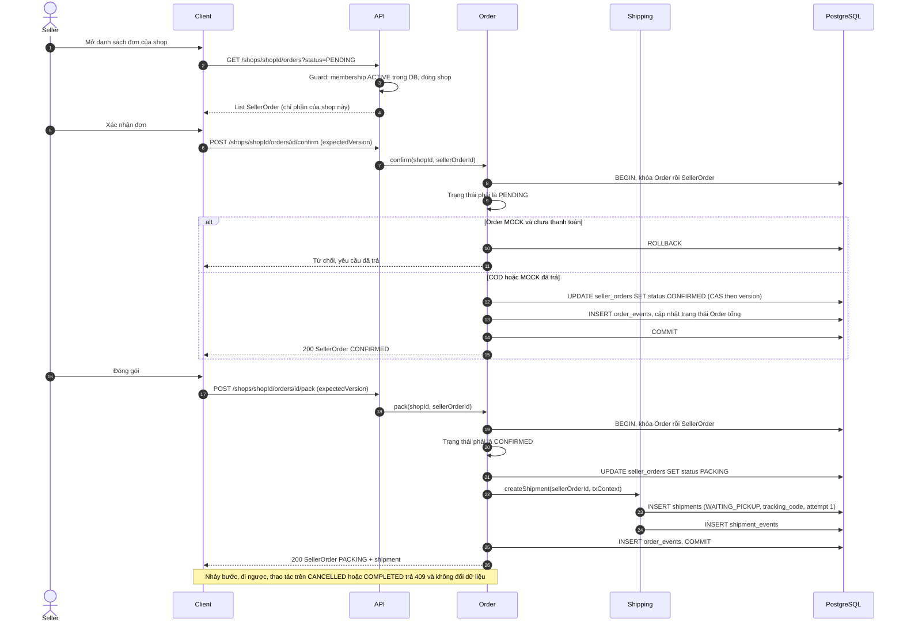
```mermaid
sequenceDiagram
  autonumber
  actor S as Seller
  participant C as Client
  participant API as API
  participant ORD as Order
  participant SHP as Shipping
  participant DB as PostgreSQL

  S->>C: Mở danh sách đơn của shop
  C->>API: GET /shops/shopId/orders?status=PENDING
  API->>API: Guard: membership ACTIVE trong DB, đúng shop
  API-->>C: List SellerOrder (chỉ phần của shop này)

  S->>C: Xác nhận đơn
  C->>API: POST /shops/shopId/orders/id/confirm (expectedVersion)
  API->>ORD: confirm(shopId, sellerOrderId)
  ORD->>DB: BEGIN, khóa Order rồi SellerOrder
  ORD->>ORD: Trạng thái phải là PENDING
  alt Order MOCK và chưa thanh toán
    ORD->>DB: ROLLBACK
    ORD-->>C: Từ chối, yêu cầu đã trả
  else COD hoặc MOCK đã trả
    ORD->>DB: UPDATE seller_orders SET status CONFIRMED (CAS theo version)
    ORD->>DB: INSERT order_events, cập nhật trạng thái Order tổng
    ORD->>DB: COMMIT
    ORD-->>C: 200 SellerOrder CONFIRMED
  end

  S->>C: Đóng gói
  C->>API: POST /shops/shopId/orders/id/pack (expectedVersion)
  API->>ORD: pack(shopId, sellerOrderId)
  ORD->>DB: BEGIN, khóa Order rồi SellerOrder
  ORD->>ORD: Trạng thái phải là CONFIRMED
  ORD->>DB: UPDATE seller_orders SET status PACKING
  ORD->>SHP: createShipment(sellerOrderId, txContext)
  SHP->>DB: INSERT shipments (WAITING_PICKUP, tracking_code, attempt 1)
  SHP->>DB: INSERT shipment_events
  ORD->>DB: INSERT order_events, COMMIT
  ORD-->>C: 200 SellerOrder PACKING + shipment

  Note over ORD,C: Nhảy bước, đi ngược, thao tác trên CANCELLED hoặc COMPLETED trả 409 và không đổi dữ liệu
```

---

## S12. Giao hàng, thu COD, nhận hàng, hoàn tất

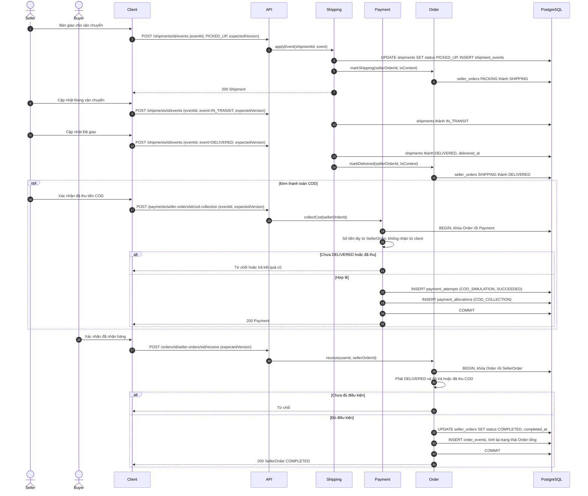
```mermaid
sequenceDiagram
  autonumber
  actor S as Seller
  actor B as Buyer
  participant C as Client
  participant API as API
  participant SHP as Shipping
  participant PAY as Payment
  participant ORD as Order
  participant DB as PostgreSQL

  S->>C: Bàn giao cho vận chuyển
  C->>API: POST /shipments/id/events (eventId, PICKED_UP, expectedVersion)
  API->>SHP: applyEvent(shipmentId, event)
  SHP->>DB: UPDATE shipments SET status PICKED_UP, INSERT shipment_events
  SHP->>ORD: markShipping(sellerOrderId, txContext)
  ORD->>DB: seller_orders PACKING thành SHIPPING
  SHP-->>C: 200 Shipment

  S->>C: Cập nhật Đang vận chuyển
  C->>API: POST /shipments/id/events (eventId, event=IN_TRANSIT, expectedVersion)
  SHP->>DB: shipments thành IN_TRANSIT

  S->>C: Cập nhật Đã giao
  C->>API: POST /shipments/id/events (eventId, event=DELIVERED, expectedVersion)
  SHP->>DB: shipments thành DELIVERED, delivered_at
  SHP->>ORD: markDelivered(sellerOrderId, txContext)
  ORD->>DB: seller_orders SHIPPING thành DELIVERED

  opt Đơn thanh toán COD
    S->>C: Xác nhận đã thu tiền COD
    C->>API: POST /payments/seller-orders/id/cod-collection (eventId, expectedVersion)
    API->>PAY: collectCod(sellerOrderId)
    PAY->>DB: BEGIN, khóa Order rồi Payment
    PAY->>PAY: Số tiền lấy từ SellerOrder, không nhận từ client
    alt Chưa DELIVERED hoặc đã thu
      PAY-->>C: Từ chối hoặc trả kết quả cũ
    else Hợp lệ
      PAY->>DB: INSERT payment_attempts (COD_SIMULATION, SUCCEEDED)
      PAY->>DB: INSERT payment_allocations (COD_COLLECTION)
      PAY->>DB: COMMIT
      PAY-->>C: 200 Payment
    end
  end

  B->>C: Xác nhận đã nhận hàng
  C->>API: POST /orders/id/seller-orders/sid/receive (expectedVersion)
  API->>ORD: receive(userId, sellerOrderId)
  ORD->>DB: BEGIN, khóa Order rồi SellerOrder
  ORD->>ORD: Phải DELIVERED và đã trả hoặc đã thu COD
  alt Chưa đủ điều kiện
    ORD-->>C: Từ chối
  else Đủ điều kiện
    ORD->>DB: UPDATE seller_orders SET status COMPLETED, completed_at
    ORD->>DB: INSERT order_events, tính lại trạng thái Order tổng
    ORD->>DB: COMMIT
    ORD-->>C: 200 SellerOrder COMPLETED
  end
```

---

## S13. Giao thất bại, giao lại, hoàn về

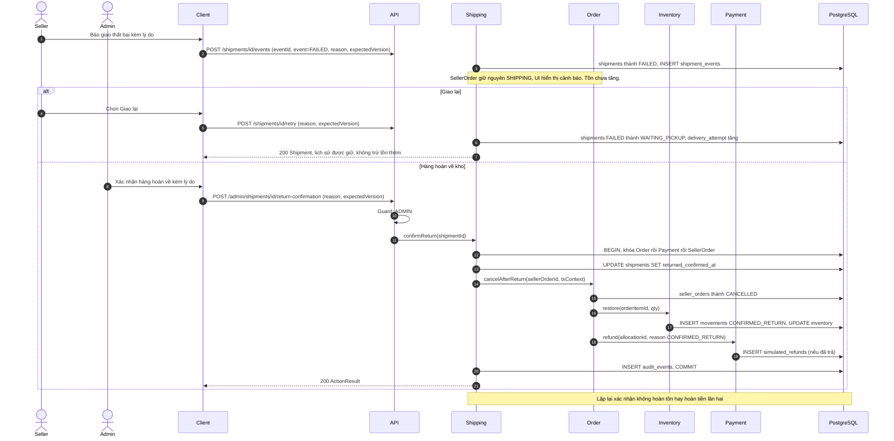
```mermaid
sequenceDiagram
  autonumber
  actor S as Seller
  actor A as Admin
  participant C as Client
  participant API as API
  participant SHP as Shipping
  participant ORD as Order
  participant INV as Inventory
  participant PAY as Payment
  participant DB as PostgreSQL

  S->>C: Báo giao thất bại kèm lý do
  C->>API: POST /shipments/id/events (eventId, event=FAILED, reason, expectedVersion)
  SHP->>DB: shipments thành FAILED, INSERT shipment_events
  Note over SHP,ORD: SellerOrder giữ nguyên SHIPPING, UI hiển thị cảnh báo. Tồn chưa tăng.

  alt Giao lại
    S->>C: Chọn Giao lại
    C->>API: POST /shipments/id/retry (reason, expectedVersion)
    SHP->>DB: shipments FAILED thành WAITING_PICKUP, delivery_attempt tăng
    SHP-->>C: 200 Shipment, lịch sử được giữ, không trừ tồn thêm
  else Hàng hoàn về kho
    A->>C: Xác nhận hàng hoàn về kèm lý do
    C->>API: POST /admin/shipments/id/return-confirmation (reason, expectedVersion)
    API->>API: Guard: ADMIN
    API->>SHP: confirmReturn(shipmentId)
    SHP->>DB: BEGIN, khóa Order rồi Payment rồi SellerOrder
    SHP->>DB: UPDATE shipments SET returned_confirmed_at
    SHP->>ORD: cancelAfterReturn(sellerOrderId, txContext)
    ORD->>DB: seller_orders thành CANCELLED
    ORD->>INV: restore(orderItemId, qty)
    INV->>DB: INSERT movements CONFIRMED_RETURN, UPDATE inventory
    ORD->>PAY: refund(allocationId, reason CONFIRMED_RETURN)
    PAY->>DB: INSERT simulated_refunds (nếu đã trả)
    SHP->>DB: INSERT audit_events, COMMIT
    SHP-->>C: 200 ActionResult
  end
  Note over SHP,DB: Lặp lại xác nhận không hoàn tồn hay hoàn tiền lần hai
```

---

## S14. Đánh giá sản phẩm *(US8, thiết kế)*

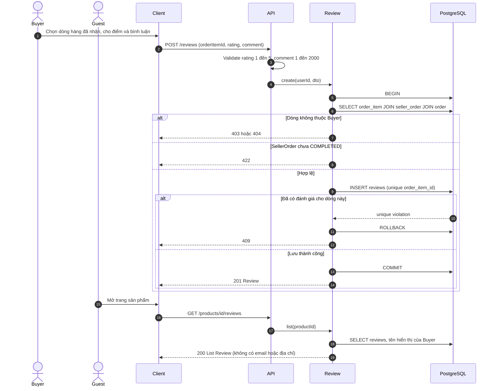
```mermaid
sequenceDiagram
  autonumber
  actor B as Buyer
  actor G as Guest
  participant C as Client
  participant API as API
  participant REV as Review
  participant DB as PostgreSQL

  B->>C: Chọn dòng hàng đã nhận, cho điểm và bình luận
  C->>API: POST /reviews (orderItemId, rating, comment)
  API->>API: Validate rating 1 đến 5, comment 1 đến 2000
  API->>REV: create(userId, dto)
  REV->>DB: BEGIN
  REV->>DB: SELECT order_item JOIN seller_order JOIN order
  alt Dòng không thuộc Buyer
    REV-->>C: 403 hoặc 404
  else SellerOrder chưa COMPLETED
    REV-->>C: 422
  else Hợp lệ
    REV->>DB: INSERT reviews (unique order_item_id)
    alt Đã có đánh giá cho dòng này
      DB-->>REV: unique violation
      REV->>DB: ROLLBACK
      REV-->>C: 409
    else Lưu thành công
      REV->>DB: COMMIT
      REV-->>C: 201 Review
    end
  end

  G->>C: Mở trang sản phẩm
  C->>API: GET /products/id/reviews
  API->>REV: list(productId)
  REV->>DB: SELECT reviews, tên hiển thị của Buyer
  REV-->>C: 200 List Review (không có email hoặc địa chỉ)
```

---

## S15. Admin khóa tài khoản và xử lý đơn thay Seller

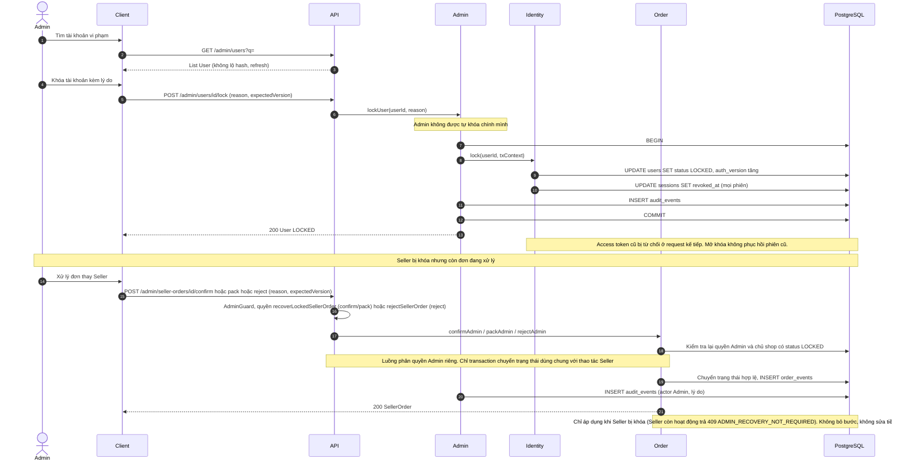
```mermaid
sequenceDiagram
  autonumber
  actor A as Admin
  participant C as Client
  participant API as API
  participant ADM as Admin
  participant ID as Identity
  participant ORD as Order
  participant DB as PostgreSQL

  A->>C: Tìm tài khoản vi phạm
  C->>API: GET /admin/users?q=
  API-->>C: List User (không lộ hash, refresh)

  A->>C: Khóa tài khoản kèm lý do
  C->>API: POST /admin/users/id/lock (reason, expectedVersion)
  API->>ADM: lockUser(userId, reason)
  Note over ADM: Admin không được tự khóa chính mình
  ADM->>DB: BEGIN
  ADM->>ID: lock(userId, txContext)
  ID->>DB: UPDATE users SET status LOCKED, auth_version tăng
  ID->>DB: UPDATE sessions SET revoked_at (mọi phiên)
  ADM->>DB: INSERT audit_events
  ADM->>DB: COMMIT
  ADM-->>C: 200 User LOCKED
  Note over ID,DB: Access token cũ bị từ chối ở request kế tiếp. Mở khóa không phục hồi phiên cũ.

  Note over A,DB: Seller bị khóa nhưng còn đơn đang xử lý
  A->>C: Xử lý đơn thay Seller
  C->>API: POST /admin/seller-orders/id/confirm hoặc pack hoặc reject (reason, expectedVersion)
  API->>API: AdminGuard, quyền recoverLockedSellerOrder (confirm/pack) hoặc rejectSellerOrder (reject)
  API->>ORD: confirmAdmin / packAdmin / rejectAdmin
  ORD->>DB: Kiểm tra lại quyền Admin và chủ shop có status LOCKED
  Note over API,ORD: Luồng phân quyền Admin riêng. Chỉ transaction chuyển trạng thái dùng chung với thao tác Seller
  ORD->>DB: Chuyển trạng thái hợp lệ, INSERT order_events
  ADM->>DB: INSERT audit_events (actor Admin, lý do)
  ORD-->>C: 200 SellerOrder
  Note over ORD,DB: Chỉ áp dụng khi Seller bị khóa (Seller còn hoạt động trả 409 ADMIN_RECOVERY_NOT_REQUIRED). Không bỏ bước, không sửa tiền, không giả danh.
```

---

## S16. Dashboard và doanh thu Seller *(US8, thiết kế)*

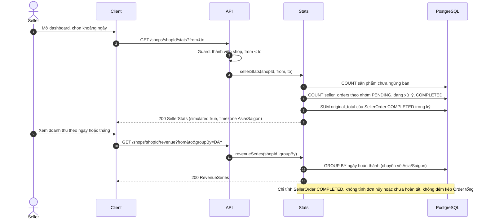
```mermaid
sequenceDiagram
  autonumber
  actor S as Seller
  participant C as Client
  participant API as API
  participant REV as Stats
  participant DB as PostgreSQL

  S->>C: Mở dashboard, chọn khoảng ngày
  C->>API: GET /shops/shopId/stats?from&to
  API->>API: Guard: thành viên shop, from < to
  API->>REV: sellerStats(shopId, from, to)
  REV->>DB: COUNT sản phẩm chưa ngừng bán
  REV->>DB: COUNT seller_orders theo nhóm PENDING, đang xử lý, COMPLETED
  REV->>DB: SUM original_total của SellerOrder COMPLETED trong kỳ
  REV-->>C: 200 SellerStats (simulated true, timezone Asia/Saigon)

  S->>C: Xem doanh thu theo ngày hoặc tháng
  C->>API: GET /shops/shopId/revenue?from&to&groupBy=DAY
  API->>REV: revenueSeries(shopId, groupBy)
  REV->>DB: GROUP BY ngày hoàn thành (chuyển về Asia/Saigon)
  REV-->>C: 200 RevenueSeries
  Note over REV,DB: Chỉ tính SellerOrder COMPLETED, không tính đơn hủy hoặc chưa hoàn tất, không đếm kép Order tổng
```

---

## Phụ lục — Quy tắc chung của các sơ đồ

1. **Thứ tự khóa không đổi:** Idempotency → User/Cart → Quote → Order → Payment → SellerOrders (theo ID) → Shop → Category → Product → Variant → Inventory (theo ID) → Shipment. Hủy, thanh toán, hết hạn và hoàn về đều khóa Order trước Payment.
2. **Không gọi mạng hoặc Object Storage trong transaction DB.**
3. **Một transaction** cho mỗi hành động: tạo đơn + trừ tồn + snapshot + dọn giỏ + lưu idempotency (S05); hủy + hoàn tồn + hoàn tiền + event (S10).
4. **Mọi lệnh đổi trạng thái** kiểm tra lại quyền, trạng thái, `expectedVersion` trong transaction; client không quyết định tiền hay trạng thái Order tổng.
5. Các thành công lặp (cùng `Idempotency-Key`/`eventId`) trả **cùng kết quả** và không tạo hiệu ứng thứ hai.
